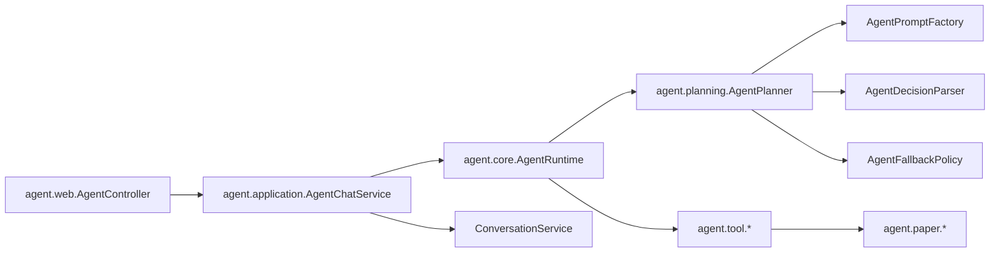

# Agent Runtime 分层重构

目标是把当前 `agent` 包从“一个包里塞满业务、协议、决策和工具治理”拆成清晰的分层式 Agent Runtime，同时不改外部行为。

## 迁移边界

- `[src/main/java/com/lqr/paperragserver/agent/service/AgentService.java](src/main/java/com/lqr/paperragserver/agent/service/AgentService.java)` 目前同时负责会话解析、历史读取、runtime 调用、最终回答流式拼接和持久化；迁移到 `agent.application.AgentChatService`，只保留应用编排。
- `[src/main/java/com/lqr/paperragserver/agent/service/AgentLoop.java](src/main/java/com/lqr/paperragserver/agent/service/AgentLoop.java)` 目前混合了状态推进、重复动作拦截、引用归一化、工具异常兜底和 SSE 事件发射；拆成 `agent.core.AgentRuntime`、`AgentState`、`AgentStep`、`AgentDecision`、`AgentActionType`，runtime 只做“决策 -> 调工具 -> 收集观察 -> 判断停止”。
- `[src/main/java/com/lqr/paperragserver/agent/service/AgentPlanner.java](src/main/java/com/lqr/paperragserver/agent/service/AgentPlanner.java)` 目前同时拼 prompt、解析 JSON、处理追问/年份/继承 query 规则、做 fallback；拆到 `agent.planning.AgentPromptFactory`、`AgentDecisionParser`、`AgentFallbackPolicy`，并把文献追问规则下沉到 `agent.paper.LiteratureFollowUpPolicy` / `LiteratureContextPolicy`。
- `[src/main/java/com/lqr/paperragserver/agent/tool/LocalPaperRetrievalAgentTool.java](src/main/java/com/lqr/paperragserver/agent/tool/LocalPaperRetrievalAgentTool.java)` 当前内联了引用过滤；把 `citationFilterReason(...)` 和统计逻辑移到 `agent.paper.CitationFilter`，保留 `local_paper_retrieval` 名称和 `localPaperChunks` metadata。
- `[src/main/java/com/lqr/paperragserver/agent/tool/LiteratureSearchAgentTool.java](src/main/java/com/lqr/paperragserver/agent/tool/LiteratureSearchAgentTool.java)` 保持工具协议不变，只做参数读取和结果封装；论文业务相关的追问与筛选 policy 不再放在工具里。
- `[src/main/java/com/lqr/paperragserver/agent/web/AgentController.java](src/main/java/com/lqr/paperragserver/agent/web/AgentController.java)`、`AgentAskRequest.java`、`AgentStreamEvent.java` 迁移到 `agent.web`，只负责 HTTP/SSE；`start / step / thought / tool_call / tool_result / delta / done / error` 事件名保持原值不变。

## 分阶段实施

1. 先抽纯逻辑和 policy：`AgentPromptFactory`、`AgentDecisionParser`、`AgentFallbackPolicy`、`CitationFilter`、`CitationNormalizer`、`LiteratureFollowUpPolicy`、`LiteratureContextPolicy`。
2. 再引入 `agent.core.AgentRuntime` / `AgentState` / `AgentStep`，让现有 `AgentLoop` 先变成薄适配层，避免一次性改坏执行链。
3. 然后把 `AgentService` 迁到 `AgentChatService`，把 web DTO 和 controller 一起收口到 `agent.web`。
4. 最后同步修正测试 import，并补新的纯逻辑单测，把当前已经锁定的行为继续钉住。

## 兼容约束

- 不改数据库、配置、认证和 `conversation` 行为。
- 不改 `local_paper_retrieval` / `literature_search` 工具名。
- 不改 SSE 字段和 `metadata` 关键字段：`type`、`agent`、`steps`、`literature`、`localPaperChunks`。
- 迁移期如有必要，保留旧类的薄代理，先保证编译和测试稳定，再考虑清理旧入口。

## 验证

- 先跑编译，再跑 `Agent*Test`，最后跑全量测试。
- 如果包名迁移导致测试 import 失败，优先修测试，不碰无关业务模块。